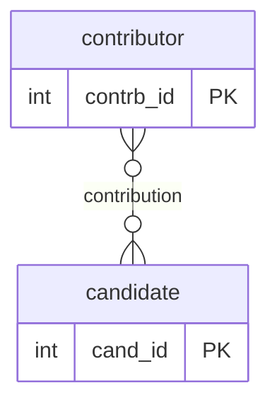
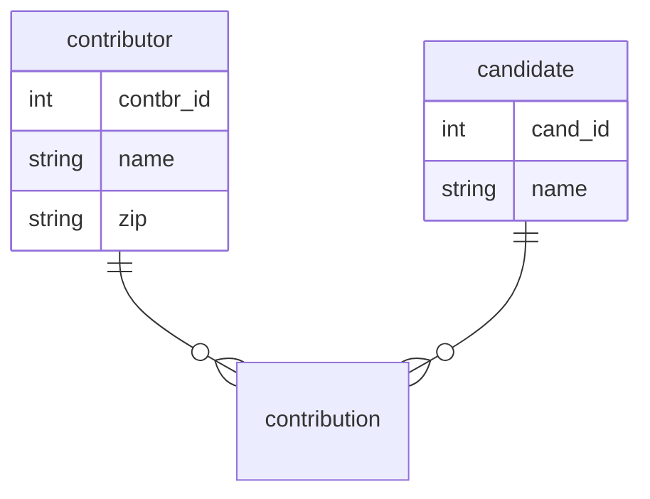
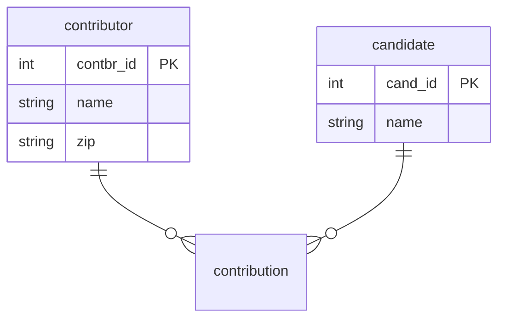
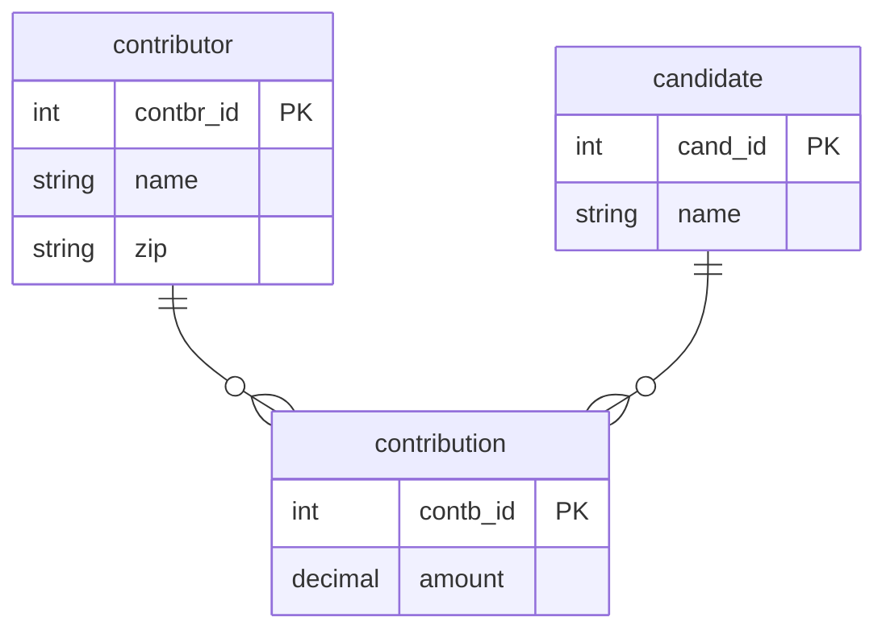
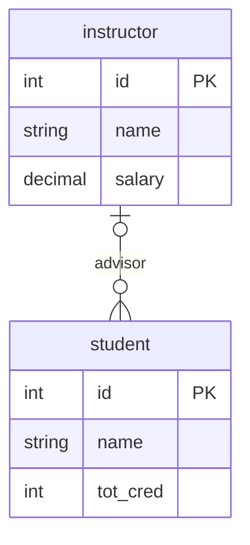
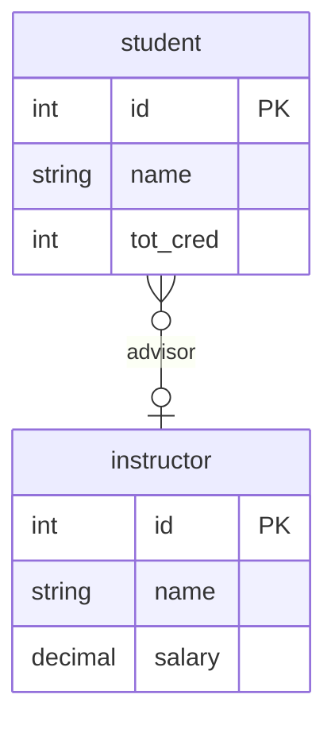
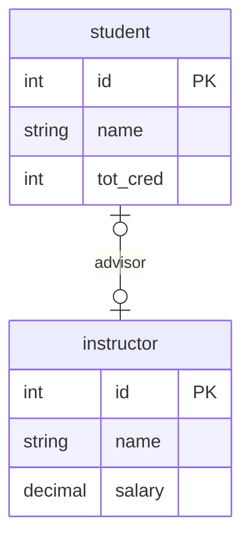
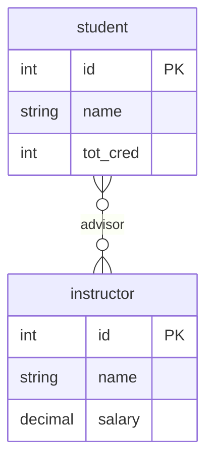

---
# try also 'default' to start simple
theme: seriph
# random image from a curated Unsplash collection by Anthony
# like them? see https://unsplash.com/collections/94734566/slidev
background: https://cover.sli.dev
# some information about your slides (markdown enabled)
title: CST 363
info: |
  ## ER Diagrams
# apply UnoCSS classes to the current slide
class: text-center
# https://sli.dev/features/drawing
drawings:
  persist: false
# slide transition: https://sli.dev/guide/animations.html#slide-transitions
# enable MDC Syntax: https://sli.dev/features/mdc
mdc: true
# duration of the presentation
duration: 35min
---

# ER Diagrams

CST 363

---

## Lecture Objectives

After this lecture, you should be able to:

<v-clicks>

- Draw diagrams from ER models
- Define "weak entity set"
- Be able to distinguish weak and strong entity sets

</v-clicks>

---

## Motivation

<v-clicks>

- We want to share the conceptual design with a wide range of stakeholders 
- Most stakeholders won’t know about database schemas or conceptual modeling
- How to share a conceptual model?

</v-clicks>

---

## ER diagram basics

 

- `contributor` and `candidate` are "entity sets"
- `contribution` is a "relationship set"

---

## Attributes of entity sets

Put attributes of entity sets:

---

## Primary keys of entity sets

Indicate the attributes that form the primary key of an entity set:

---

## Attributes of relationship sets

Put attributes of relationship sets:

---

## Mapping cardinalities

Show that each a student can have at most one advisor:

---

## All kinds of mapping cardinalities (1 of 3)

A student can have at most one advisor

---

## All kinds of mapping cardinalities (2 of 3)

- An instructor can advise at most one student; a student can have at most one advisor
  - 1:1, optional on both sides

 

---

## All kinds of mapping cardinalities (3 of 3)

- A student can be advised by multiple instructors; an instructor can advise multiple students
  - M:N, optional on both sides

 

---

## Crow’s Foot — 1:1

 

- optional, and at most 1

---

## Crow’s Foot — 1:M

 

- Each instructor can advise multiple students.
- Each student may have an advisor (optional).

---

## Crow’s Foot — M:N

---
layout: center
---

---

## Summary

- ER models can be visualized.
- This helps the data designer, and also helps when sharing a model with stateholders.
- One complication is “weak entity sets”.

